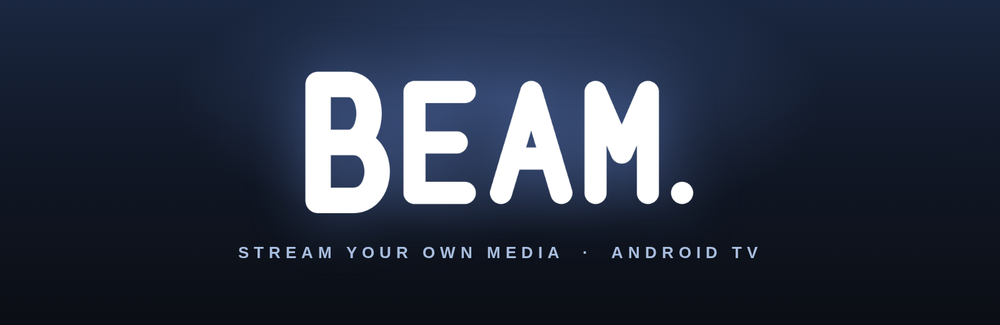
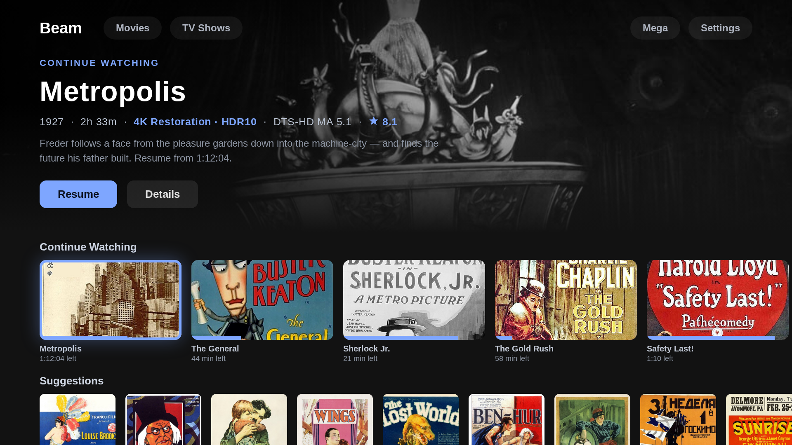
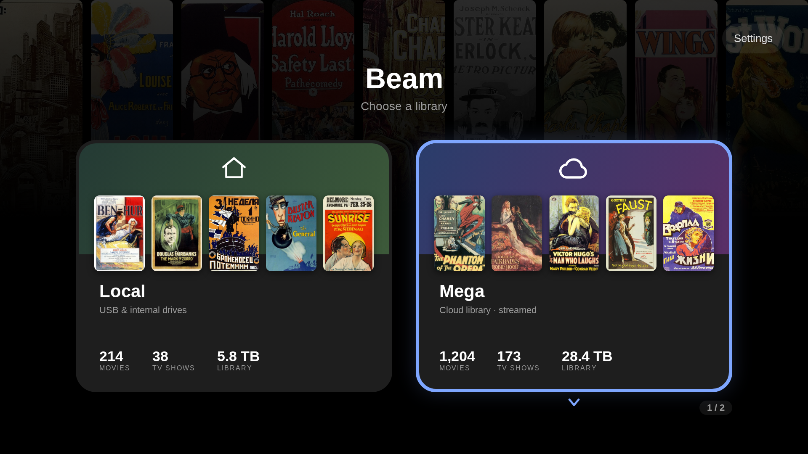
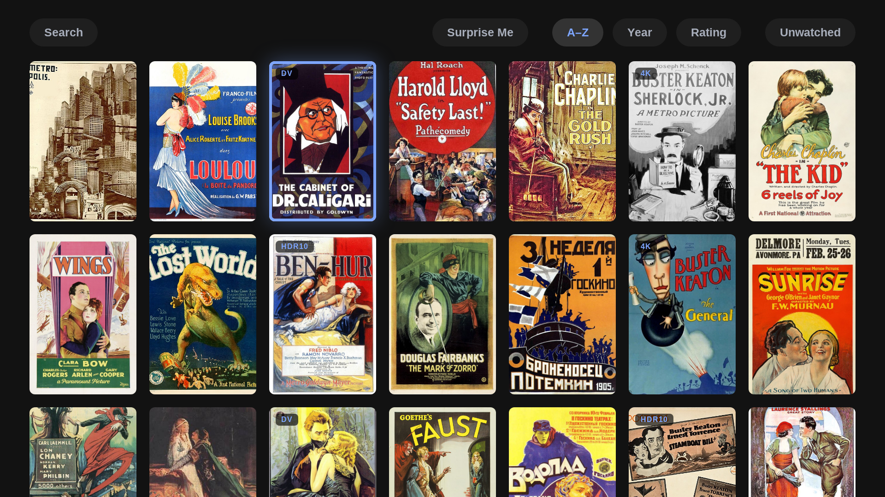
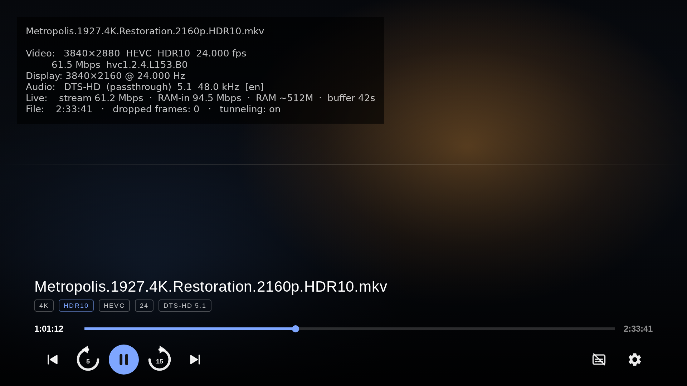

  

<b>Your cloud storage, your seedbox, your USB drives — one native Android TV library, streamed raw to the big screen.</b>

  
  

Beam turns an Android TV box into a direct line to your own media, wherever it lives. No Plex server, no transcoding box in a closet, no per-source apps: an embedded engine streams the original bytes straight to the decoder, with RAM read-ahead tuned hard enough that high-bitrate 4K HDR remuxes play smoothly on hardware as old as the 2015 NVIDIA SHIELD.

##  Three libraries, one chooser

<table><tr>
<td width="33%" valign="top"><b>Mega</b> Sign in once — your cloud library appears as a poster wall. An embedded streaming engine serves files directly; nothing is downloaded first.</td>
<td width="33%" valign="top"><b>Seedbox (HTTPS)</b> Point Beam at any HTTPS file server and it becomes a second cloud library with its own isolated streaming engine — a misbehaving box can never touch Mega playback.</td>
<td width="33%" valign="top"><b>Local Drives</b> USB and internal storage with explicit per-drive Movies/TV folder assignment. Incremental scans; detached drives are remembered and flagged, not forgotten.</td>
</tr></table>

Each source is its own library with its own artwork, stats, and hub. Extra streamed sources stack neatly into the chooser — and Beam remembers which library you picked last and starts there.

##  Built for the couch

- **A real TV hub** — a static cinematic hero that mirrors whatever rail item has focus, above **Continue Watching**, **Up Next**, and per-launch shuffled **Suggestions** rails.
- **TMDB + OMDb metadata** — posters, backdrops, ratings, and awards, cached on-device with a configurable image cache (256 MB – 1 GB).
- **Instant library search** across movies and shows.
- **Resume everywhere** — every play action, from any rail or grid, picks up exactly where you stopped.
- **D-pad first** — every screen designed and battle-tested for remote navigation on a Leanback launcher, in Jetpack Compose for TV.

##  Playback that respects the source

- **Match Frame Rate** — switches the TV to the film's native rate to kill judder.
- **Tunneled Playback** — hardware A/V sync for high-bitrate 4K/HDR streams.
- **Auto-Play Next Episode** — with an Up Next card near the end of each episode: OK plays now, Back cancels.
- **Playback Info Overlay** — a live stats panel: codec, content fps vs display Hz, dropped frames, live stream bitrate, and how many megabytes of RAM runway the engine is holding — refreshed every second, toggleable in Settings.
- **Analyze Media Specs** — an on-device probe reads each file's real codec, resolution, HDR type, and audio track — down to Dolby Vision profile strings (`dvhe.07.06`), HDR10, and TrueHD Atmos.
- **External player handoff** — prefer VLC, MX Player, or Just Player? Beam hands them the stream URL and a foreground service keeps the engine alive while they play.
- **Display control** — pin the whole app UI to a chosen refresh rate, or leave it to the system.

##  Under the hood

- **Embedded streaming engine** runs as a local server; the player streams from `127.0.0.1`, so every source looks identical to the decoder.
- **Per-source tuned RAM read-ahead** — a 128 MB player buffer backed by hundreds of megabytes of engine-side read-ahead, profiled on real hardware until cold starts, seeks, and steady-state playback all held up on a memory-constrained 2015 SHIELD.
- **Dual engines** — a tuned stable engine as the default, with a one-toggle experimental modern engine for A/B testing on your own device.
- **Room-backed catalog** — the library, watch state, and media specs live in a relational store; the app starts from cache instantly and scans refresh incrementally.

##  Media Server for Kodi

One toggle publishes the whole library — movies and TV with covers and titles — as a **UPnP/DLNA media server**. Kodi (or any UPnP client) browses Beam and direct-plays from Mega and local drives, with Beam's engine relaying the bytes. Survives reboots until you switch it off.

##  Tech stack

  
  
  
  
  

Screens shown are design renders of the app's actual UI layouts; poster artwork is public-domain classic-film posters via Wikimedia Commons.
